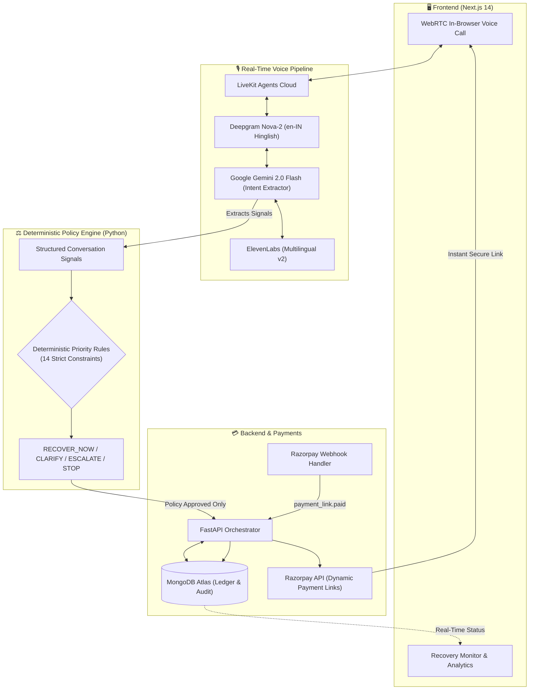

# 🎯 AI Revenue Recovery Agent
### Autonomous, policy-governed voice agent recovering failed & overdue payments in real-time via Razorpay

<p align="center">
  
  
  
  
  
  
  
  
  
  
</p>

---

## 💡 Overview & Core Philosophy

Traditional recovery involves cold robo-calls, manual dunning, or inflexible payment reminders. **AI Revenue Recovery Agent** combines real-time conversational Hinglish voice with strict financial safeguards.

> 🔒 **The Golden Rule:** The voice interaction is only the interface. The product is a **deterministic, policy-driven recovery engine**. LLMs never control money, never invent amounts, and can never generate payment links without policy clearance.

---

## 🏛️ System Architecture



<details>
<summary><b>🔍 How the Architecture Works (Click to Expand)</b></summary>

1. **Ultra-Low Latency Voice:** WebRTC stream via LiveKit Cloud, transcribed with Deepgram Nova-2 (optimized for Indian accents and Hinglish), synthesized with ElevenLabs natural speech.
2. **Signal Extraction (Not Decision Making):** Gemini 2.0 Flash parses customer intent, reasons for failure, disputes, or promise-to-pay dates into typed `ConversationSignals`.
3. **Hard Policy Gating:** Python policy rules execute in priority order. If an invoice dispute or unverified customer is detected, payment link creation is hard-blocked and escalated to a human.
4. **Real-Time Recovery Loop:** When approved, the system generates a Razorpay link with amounts locked to the database ledger. Payment completion fires a signed webhook, instantly logging recovered revenue.
</details>

---

## 🛠️ Tech Stack

| Component | Technologies | Role & Highlights |
|---|---|---|
| **Frontend** |    | Real-time recovery dashboard, timeline, and in-browser voice room |
| **Backend** |    | Async REST endpoints, recovery state machine, audit log tracking |
| **Voice & Speech** |    | WebRTC transport, Silero VAD, Indian English / Hinglish speech engine |
| **LLM Reasoning** |  | High-speed intent extraction, root cause classification, date parsing |
| **Policy Engine** |  | 100% deterministic decision-making (cannot be overridden by LLM) |
| **Database** |  | Customer records, immutable audit events, promise-to-pay registry |
| **Payment Gateway** |  | Dynamic payment links, UPI/Card/Netbanking support, webhooks |

---

## ⚡ Quickstart Guide

### 1. Environment Configuration

Copy the example configuration to `.env`:
```bash
cp backend/.env.example backend/.env
```

Ensure API keys for **MongoDB Atlas**, **Razorpay (Test Mode)**, **LiveKit Cloud**, **Google Gemini**, **Deepgram**, and **ElevenLabs** are set.

### 2. Install & Seed Database

```bash
# 1. Install Python dependencies (from project root)
uv sync

# 2. Seed / Reset clean database state
cd backend
python scripts/reset_db.py
```

### 3. Start the Stack

```bash
# Terminal 1 — Backend API
cd backend && uvicorn app.main:app --reload --port 8000

# Terminal 2 — Voice Agent Worker
cd backend && python app/agents/voice_agent.py start

# Terminal 3 — Frontend Dashboard
cd frontend && npm install && npm run dev

# Terminal 4 — Webhook Tunnel (for local Razorpay webhooks)
ngrok http 8000
```
Open [http://localhost:3000](http://localhost:3000) to view the recovery dashboard and start calls.

<details>
<summary><b>🔗 Webhook Setup Instructions (Razorpay + ngrok)</b></summary>

1. Start ngrok: `ngrok http 8000` and copy your forwarding URL (`https://<subdomain>.ngrok-free.app`).
2. Go to **Razorpay Dashboard → Settings → Webhooks → Add New Webhook**.
3. URL: `https://<subdomain>.ngrok-free.app/api/webhooks/razorpay`.
4. Active events: `payment_link.paid` & `payment.captured`.
5. Set secret and paste it into `RAZORPAY_WEBHOOK_SECRET` in `backend/.env`.
</details>

---

## 🛡️ Deterministic Policy Engine

The policy engine (`backend/app/policies/recovery_policy.py`) evaluates requests in strict priority order:

| Priority | Condition | Decision | Behavior |
|---|---|---|---|
| **1** | `payment_status == PAID` | `STOP_PAID` | Cease interaction immediately |
| **2** | `amount_due <= 0` | `STOP_NO_DUE` | No debt collection possible |
| **3** | Unverified / Unknown Customer | `ESCALATE` | Prevent social engineering & fraud |
| **4** | Contact change requested | `ESCALATE` | Protects against payment link redirection |
| **5** | Invoice dispute raised | `ESCALATE` | Stops bot, sends case to human review |
| **6** | Customer refuses to pay | `STOP_REFUSED` | Halts calls respectfully, logs audit |
| **7** | Amount mismatch (Customer vs DB) | `CLARIFY` | Blocks links until amounts reconcile |
| **8** | `call_attempts >= MAX_CALL_ATTEMPTS` | `STOP_MAX_ATTEMPTS` | Prevents customer harassment |
| **9** | `recovery_days > MAX_RECOVERY_DAYS` | `STOP_WINDOW_EXPIRED` | Case transferred to collections team |
| **10** | Promise to Pay committed | `TRACK_PROMISE_TO_PAY` | Records scheduled payment date |
| **11a** | Verified + willing + active link exists | `RESEND_EXISTING_LINK` | Reuses existing payment link |
| **11b** | Verified + willing + amount > ₹25,000 | `ESCALATE` | High-value threshold human sign-off |
| **11c** | Verified + willing + ₹5,001–₹25,000 | `NEEDS_ADDITIONAL_VERIFICATION` | Secondary verification needed |
| **11d** | Verified + willing + amount ≤ ₹5,000 | `RECOVER_NOW` | Automatically creates Razorpay payment link |

---

## 🧪 Test Scenarios & Verification

All detailed voice conversation scripts, edge case tests, and automated policy unit tests are documented in the **Tests & Verification Guide**:

👉 **[View Complete Test Scenarios & Verification Guide](tests/README.md)**

### Running Policy Engine Automated Tests:
```bash
cd backend
pytest tests/test_policy_engine.py -v
```
*(All 25 test cases pass validating every policy rule and edge condition)*

---

## 🔒 Security Highlights

- **Server-Side Secrets:** Razorpay and LiveKit credentials never touch the browser.
- **HMAC Signature Verification:** Every Razorpay webhook payload is validated before state updates.
- **Database Ground Truth:** Payment link amounts are derived strictly from MongoDB ledgers — never from customer prompts or LLM output.
- **Audit Logging:** Every call, state transition, and policy evaluation generates an immutable audit record.
